# Estate_Nexus_Dhaka

---

## Table of Contents

Chapter 1 — Introduction and Case Study \
Chapter 2 — Functional Requirements and User Stories \
Chapter 3 — UI Navigation Diagram and Flow Explanation \
Chapter 4 — Database Design, Table Descriptions, and Normalisation \
Chapter 5 — SQL Queries, Feature by Feature, with Explanations \
Chapter 6 — User Interface Design and Screenshots \
Chapter 7 — Work Distribution Table \
Chapter 8 — Conclusion and Future Work

---

# Chapter 1 — Introduction and Case Study

## 1.1 Project Overview

EstateNexus is a role-based real estate management system built as a Windows desktop application. The system allows buyers and tenants to search and purchase or rent residential and commercial properties, allows sellers to manage their property listings, and gives a system administrator full oversight of users, listings, and platform-level revenue. The application runs entirely on a local machine using .NET 10 Windows Forms, and stores all data in a Microsoft SQL Server database.

The system was designed around a realistic scenario: the real estate market in Dhaka, Bangladesh. Properties in Dhaka span multiple districts and categories, from luxury apartments in Gulshan to commercial offices in Dhanmondi and plots in Purbachal. EstateNexus was built to reflect this market by supporting district-based filtering, taka-based pricing, and local payment methods like Bkash and Nagad alongside conventional card and bank transfer options.

## 1.2 Case Study

The scenario that motivated this project is a common problem for first-time property seekers in Dhaka. Listings are scattered across social media posts, PDF brochures sent over WhatsApp, and brokers who charge separate consultation fees. There is no single verified platform where a buyer can browse available properties, check pricing transparently, schedule a physical visit, and complete a purchase all in one place.

EstateNexus addresses this by creating a centralized system where:

Sellers register and list verified properties with location, images, price, and specifications. A Super Admin reviews and approves seller accounts before they can list anything, which builds trust and keeps fraudulent listings off the platform. Customers can then register immediately, browse the full catalog using filters for listing type, category, district, price range, and number of bedrooms, and add properties to a shopping cart. When they are ready to proceed, they select a payment method and check out. The system records the order, generates an invoice with a unique invoice number, and automatically deducts a 5% commission for the platform before calculating the seller payout. Properties that are purchased or rented are immediately marked as Sold or Rented so they are no longer shown in the public browse view.

## 1.3 Technology Stack

The project uses the following technologies:

Programming Language: C# 14.0 targeting .NET 10.0

Application Framework: Windows Forms (net10.0-windows)

ORM: Entity Framework Core 10.0.11 with SQL Server provider

Database: Microsoft SQL Server (LocalDB or Express)

Data Provider: Microsoft.Data.SqlClient 7.0.2

Development Environment: Visual Studio 2022 / 2026 Preview

## 1.4 System Roles

The system defines three roles stored in the Roles table:

Customer: A buyer or tenant who browses listings, manages a cart, completes purchases, schedules property visits, and submits reviews and ratings.

Admin (Seller): A property owner or agent who lists properties with images, edits listing details, reviews incoming visit requests from customers, and tracks their sales revenue.

SuperAdmin: A platform administrator who approves or rejects seller registrations, suspends accounts, removes inappropriate listings, and monitors commission revenue.

---

# Chapter 2 — Functional Requirements and User Stories

## 2.1 Authentication and Registration

**FR-01** The system must allow a user to log in using either their registered email address or their username.

**FR-02** The system must verify the password against a SHA-256 hash stored in the database. If a legacy plain-text password is detected upon successful login, the system must upgrade it to a SHA-256 hash automatically.

**FR-03** The login form must display an inline error message if the email or password field is left empty. It must use an ErrorProvider component to highlight the specific field.

**FR-04** A Show/Hide password toggle must let the user switch between masked and visible password input.

**FR-05** A Clear button must reset all inputs and active error indicators on the login form.

**FR-06** The system must block login for accounts with AccountStatus of Pending or Suspended, and display a specific message explaining why access was denied.

**FR-07** The registration form must accept Full Name, Email, Phone, Password, Confirm Password, and Role selection.

**FR-08** Password must be at least 6 characters. Confirm Password must match the Password field.

**FR-09** Customer registrations must be automatically activated (AccountStatus = Active). Admin/Seller registrations must be placed in Pending status and must wait for Super Admin approval before logging in.

**FR-10** After a successful login, the system must route the user to the correct dashboard based on their role: CustomerDashboard, AdminDashboard, or SuperAdminDashboard.

User Story 1: As a new buyer, I want to register with my email address and choose the Customer role so that I can immediately log in and browse properties without waiting for approval.

User Story 2: As a property seller, I want to register as an Admin so that I can list my properties, knowing that my account will be reviewed by the platform before I get access.

User Story 3: As a returning user, I want to log in using my email and password and be taken straight to my dashboard without navigating through extra screens.

## 2.2 Customer Features

**FR-11** The customer browse tab must load all properties with ApprovalStatus = Approved and PropertyStatus = Available from the database when the form opens.

**FR-12** The customer must be able to filter properties by listing type (Sale or Rent), category (Apartment, House, Commercial, Land), district (populated dynamically from available listings), price range, and bedroom count.

**FR-13** A keyword search box must filter properties by matching the search term against the property title, district, or area location.

**FR-14** A live result count label must update every time a filter is applied, showing the number of matched properties.

**FR-15** Featured properties must appear at the top of the browse results, followed by the most recently created properties.

**FR-16** The customer must be able to select a property from the browse grid and click Add to Cart. For rental properties, the customer must specify the number of rental months, and the total cost must be calculated automatically as Price × Months.

**FR-17** The cart must prevent adding a property that is already in the cart or is no longer available.

**FR-18** A Remove button must let the customer remove individual items from their cart before checkout.

**FR-19** The checkout process must require the customer to select a payment method from: Cash, Card, Bkash, Nagad, or Bank Transfer.

**FR-20** On checkout, the system must create an Order, a Payment record, one OrderItem per cart entry, update each property's status to Sold or Rented, calculate a 5% commission, create a Commission record, and generate a uniquely numbered Invoice — all within a single database transaction that rolls back completely if any step fails.

**FR-21** After checkout, an invoice modal must open automatically displaying all order details. A Print button must send the invoice to the system printer.

**FR-22** The customer must be able to schedule a site visit for a property by selecting a date (from tomorrow onwards), a time slot, and an optional note.

**FR-23** The customer must be able to view and cancel pending visit requests from a My Visits tab.

**FR-24** The customer must be able to submit a 1 to 5 star rating and a written review for a property they have purchased.

**FR-25** The customer must be able to view and update their profile information including full name, phone, address, and profile picture.

User Story 4: As a customer, I want to filter properties by district and price range so that I only see listings that are relevant to what I can afford and where I want to live.

User Story 5: As a customer renting a property, I want to set the rental duration in months when adding the property to my cart so that the total amount is calculated for me automatically.

User Story 6: As a customer, I want to pay via Bkash at checkout and receive a printed invoice immediately so that I have a physical record of my transaction.

User Story 7: As a customer, I want to schedule a visit to a property I am interested in by picking a date and time, and I want to be able to cancel the request if my plans change.

## 2.3 Seller / Admin Features

**FR-26** The seller must be able to add a new property listing by filling in category, title, listing type, district, area location, full address, area size, bedrooms, bathrooms, price, and a text description.

**FR-27** The seller must be able to upload a property image and preview it before saving.

**FR-28** The seller must be able to select one of their existing listings from a grid and edit all of its details.

**FR-29** The seller dashboard must show a summary of total listings, available listings, and sold listings.

**FR-30** The seller must be able to view all visit requests submitted for their properties. The requests must be sortable with pending visits shown first.

**FR-31** The seller must be able to accept or reject pending visit requests from the visit requests tab.

**FR-32** The seller must be able to view a list of completed sales, including buyer name, property title, payment method, and final sale amount.

User Story 8: As a seller, I want to add a new property with images and a description so that customers can see exactly what they are getting before they enquire.

User Story 9: As a seller, I want to see which visit requests are pending so that I can approve the ones I am available for and reject the ones I cannot accommodate.

## 2.4 Super Admin Features

**FR-33** The Super Admin dashboard must show a real-time badge count of all accounts currently in Pending status.

**FR-34** The Super Admin must be able to view all registered users in a grid filterable by role (Customer, Admin, SuperAdmin) and by account status (Pending, Active, Suspended).

**FR-35** The Super Admin must be able to approve a pending seller account (setting AccountStatus to Active) or reject it (setting AccountStatus to Suspended) with a single click.

**FR-36** The Super Admin must be able to suspend an active account or reactivate a suspended account.

**FR-37** The system must prevent the Super Admin from suspending, rejecting, or altering their own account.

**FR-38** The Super Admin must be able to view all properties across the entire platform and remove any listing.

**FR-39** The Super Admin must be able to view revenue figures including total transaction volume and total 5% commission earned by the platform.

User Story 10: As a Super Admin, I want to approve a seller's registration so that their account becomes active and they can start listing properties on the platform.

User Story 11: As a Super Admin, I want to filter users by status so that I can quickly find all accounts that are still pending review without scrolling through the entire user list.

---

# Chapter 3 — UI Navigation Diagram and Flow Explanation

## 3.1 Navigation Diagram

The diagram below shows how screens connect to each other in the application.

```
[Application Start]
        |
        v
  [LoginForm]  <----- [RegistrationForm]
        |
        |--- Role = SuperAdmin ---> [SuperAdminDashboard]
        |                               |--- Tab: Users
        |                               |--- Tab: Properties
        |                               |--- Tab: Revenue
        |
        |--- Role = Admin ---------> [AdminDashboard]
        |                               |--- Tab: My Properties
        |                               |       |--- [AddPropertyForm] (Add New)
        |                               |       |--- [AddPropertyForm] (Edit)
        |                               |--- Tab: Visit Requests
        |                               |--- Tab: Sales
        |
        |--- Role = Customer ------> [CustomerDashboard]
                                        |--- Tab: Browse Properties
                                        |       |--- [ScheduleVisitForm]
                                        |--- Tab: My Cart
                                        |       |--- [InvoiceForm] (after checkout)
                                        |--- Tab: My Orders
                                        |       |--- [InvoiceForm] (view past)
                                        |--- Tab: My Visits
                                        |--- Tab: Reviews
                                        |--- Tab: My Profile
```

## 3.2 Flow Explanation

**Login and Registration Flow**

When the application starts, the LoginForm is the first screen shown. The user enters their email or username and password. If the credentials are correct and the account is Active, the application routes the user to the dashboard matching their role. If the account is Pending, a message is shown explaining that approval is required. If the account is Suspended, a different message directs the user to contact support.

From the login screen the user can navigate to the RegistrationForm. After filling in their details and selecting Customer or Admin as their role, they are registered. Customer accounts go directly to Active status. Admin accounts go to Pending and cannot log in until a Super Admin approves them.

**Customer Flow**

After logging in, the customer lands on the CustomerDashboard. This form contains six tabs. The Browse Properties tab loads all approved and available listings immediately. The customer can type a keyword or use the dropdown filters to narrow results. Clicking Add to Cart on a selected listing adds it to the cart. For rental listings the customer first sets the rental months using a number spinner before adding.

The My Cart tab shows all items in the active cart with a running total. The customer selects a payment method from a dropdown, confirms the purchase, and the system executes the checkout transaction. On success, the InvoiceForm opens automatically. The customer can print the invoice or close it.

The My Visits tab shows any site visits the customer has requested. Pending requests can be cancelled. From the Browse tab the customer can also click Schedule Visit on a selected property, which opens the ScheduleVisitForm where they pick a date and time and optionally write a note.

The Reviews tab lets the customer select a past order and submit a star rating and written comment for the property.

The My Profile tab lets the customer update their name, phone, address, and upload a profile picture.

**Seller Flow**

After logging in, the seller lands on the AdminDashboard with three tabs. My Properties shows a grid of all listings owned by the seller with a summary of total, available, and sold counts. Clicking Add Property opens AddPropertyForm as a blank form. Selecting a listing and clicking Edit opens AddPropertyForm pre-filled with the current property data.

The Visit Requests tab shows all incoming requests from customers for the seller's properties. Pending requests appear at the top. The seller can approve or reject any pending request.

The Sales tab shows all completed order records involving the seller's properties.

**Super Admin Flow**

The SuperAdminDashboard has three tabs. The Users tab loads all registered accounts in a filterable grid. The Super Admin selects a user and uses buttons to approve, reject, suspend, or reactivate. The platform's self-protection logic prevents any of these actions from being applied to the Super Admin's own account.

The Properties tab shows every listing on the platform. The Super Admin can delete any listing.

The Revenue tab shows aggregated financial figures including total transaction volume and the cumulative 5% commission earned.

---

# Chapter 4 — Database Design, Table Descriptions, and Normalisation Justification

## 4.1 Entity Relationship Summary

The database contains 19 tables, all conforming to Third Normal Form (3NF). The database engine is Microsoft SQL Server. The schema is defined in EstateNexusDB_Schema.sql and is automatically applied by DatabaseSetup.cs when the application starts for the first time.

## 4.2 Table Descriptions

**Table 1 — Roles**

Stores the three system roles. Primary Key: RoleId (INT, IDENTITY).

| Column | Type | Notes |
|--------|------|-------|
| RoleId | INT | Primary Key, Identity |
| RoleName | NVARCHAR(50) | Unique. Values: Customer, Admin, SuperAdmin |
| RoleDescription | NVARCHAR(255) | Nullable |
| CreatedDate | DATETIME | Default: GETDATE() |

**Table 2 — Users**

Stores all registered accounts regardless of role. Password is always stored as a SHA-256 hex string. AccountStatus controls whether the account can log in.

| Column | Type | Notes |
|--------|------|-------|
| UserId | INT | Primary Key, Identity |
| RoleId | INT | Foreign Key to Roles |
| FullName | NVARCHAR(100) | Required |
| Email | NVARCHAR(100) | Unique, Required |
| Username | NVARCHAR(50) | Nullable |
| Phone | NVARCHAR(20) | Nullable |
| PasswordHash | NVARCHAR(256) | SHA-256 hex. Required |
| Address | NVARCHAR(255) | Nullable |
| ProfileImagePath | NVARCHAR(500) | Nullable |
| AccountStatus | NVARCHAR(20) | Active, Pending, Suspended. Default: Active |
| IsActive | BIT | Default: 1 |
| CreatedDate | DATETIME | Default: GETDATE() |

**Table 3 — PropertyCategories**

Lookup table for property types. Prevents hardcoding category names across the application.

| Column | Type | Notes |
|--------|------|-------|
| CategoryId | INT | Primary Key, Identity |
| CategoryName | NVARCHAR(50) | Unique. Values: Apartment, House, Commercial, Land |
| Description | NVARCHAR(255) | Nullable |
| IsActive | BIT | Default: 1 |

**Table 4 — Properties**

The central table of the application. Each row is one property listing owned by one seller.

| Column | Type | Notes |
|--------|------|-------|
| PropertyId | INT | Primary Key, Identity |
| OwnerId | INT | Foreign Key to Users |
| CategoryId | INT | Foreign Key to PropertyCategories |
| PropertyTitle | NVARCHAR(150) | Required |
| ListingType | NVARCHAR(20) | Sale or Rent |
| District | NVARCHAR(100) | Required |
| AreaLocation | NVARCHAR(100) | Required |
| FullAddress | NVARCHAR(255) | Required |
| AreaSize | DECIMAL(10,2) | Required |
| AreaUnit | NVARCHAR(20) | Default: sqft |
| Bedrooms | INT | Nullable in model, Default: 0 |
| Bathrooms | INT | Nullable in model, Default: 0 |
| Price | DECIMAL(18,2) | Required |
| Description | NVARCHAR(MAX) | Nullable |
| PropertyStatus | NVARCHAR(20) | Available, Reserved, Sold, Rented. Default: Available |
| ApprovalStatus | NVARCHAR(20) | Pending, Approved, Rejected. Default: Pending |
| IsFeatured | BIT | Default: 0 |
| CreatedDate | DATETIME | Default: GETDATE() |
| UpdatedDate | DATETIME | Nullable |

**Table 5 — PropertyImages**

Stores image file paths linked to a property. Multiple images per property are supported. Deleting a property cascades to its images.

| Column | Type | Notes |
|--------|------|-------|
| ImageId | INT | Primary Key, Identity |
| PropertyId | INT | Foreign Key to Properties (CASCADE DELETE) |
| ImagePath | NVARCHAR(500) | Required |
| IsPrimary | BIT | Default: 0 |
| UploadedDate | DATETIME | Default: GETDATE() |

**Table 6 — Offers**

Stores discount offers attached to specific properties. Supports both percentage and flat-amount discount types. Currently provisioned for future use.

| Column | Type | Notes |
|--------|------|-------|
| OfferId | INT | Primary Key, Identity |
| PropertyId | INT | Foreign Key to Properties |
| DiscountType | NVARCHAR(50) | Percentage or Flat |
| DiscountValue | DECIMAL(18,2) | Required |
| StartDate | DATETIME | Required |
| EndDate | DATETIME | Required |
| IsActive | BIT | Default: 1 |

**Table 7 — PropertyFeatures**

Master lookup for amenity features such as Swimming Pool, Elevator, Car Parking, and 24/7 Security.

| Column | Type | Notes |
|--------|------|-------|
| FeatureId | INT | Primary Key, Identity |
| FeatureName | NVARCHAR(100) | Unique |
| Description | NVARCHAR(255) | Nullable |

**Table 8 — PropertyFeatureMappings**

Junction table implementing the many-to-many relationship between Properties and PropertyFeatures. Uses a composite primary key.

| Column | Type | Notes |
|--------|------|-------|
| PropertyId | INT | Part of composite Primary Key, FK to Properties |
| FeatureId | INT | Part of composite Primary Key, FK to PropertyFeatures |

**Table 9 — FeaturedListings**

Tracks paid featured listing promotions that give properties priority placement. Provisioned for future use.

| Column | Type | Notes |
|--------|------|-------|
| FeaturedListingId | INT | Primary Key, Identity |
| PropertyId | INT | Foreign Key to Properties |
| FeaturedFee | DECIMAL(18,2) | Required |
| StartDate | DATETIME | Required |
| EndDate | DATETIME | Required |
| PaymentStatus | NVARCHAR(50) | Default: Pending |
| Status | NVARCHAR(50) | Active, Expired, Cancelled |

**Table 10 — Carts**

Each customer has one active cart at a time. When checkout is completed, the cart is deactivated and a new cart is created on the next add-to-cart action.

| Column | Type | Notes |
|--------|------|-------|
| CartId | INT | Primary Key, Identity |
| CustomerId | INT | Foreign Key to Users (CASCADE DELETE) |
| CreatedDate | DATETIME | Default: GETDATE() |
| IsActive | BIT | Default: 1 |

**Table 11 — CartItems**

Individual property items inside a cart. RentalMonths defaults to 1 for sale items but is set by the customer for rental listings.

| Column | Type | Notes |
|--------|------|-------|
| CartItemId | INT | Primary Key, Identity |
| CartId | INT | Foreign Key to Carts (CASCADE DELETE) |
| PropertyId | INT | Foreign Key to Properties (NO ACTION) |
| RentalMonths | INT | Default: 1 |
| OfferedPrice | DECIMAL(18,2) | Nullable. Pre-computed total |
| AddedDate | DATETIME | Default: GETDATE() |

**Table 12 — Orders**

One order per completed checkout transaction. Contains the total value and transaction type.

| Column | Type | Notes |
|--------|------|-------|
| OrderId | INT | Primary Key, Identity |
| CustomerId | INT | Foreign Key to Users |
| OrderDate | DATETIME | Default: GETDATE() |
| TotalAmount | DECIMAL(18,2) | Required |
| OrderStatus | NVARCHAR(50) | Completed, Pending, Cancelled. Default: Completed |
| TransactionType | NVARCHAR(50) | Sale or Rent |

**Table 13 — OrderItems**

Individual line items within an order. References the property, the seller (OwnerId), the rental months, unit price, and final amount.

| Column | Type | Notes |
|--------|------|-------|
| OrderItemId | INT | Primary Key, Identity |
| OrderId | INT | Foreign Key to Orders (CASCADE DELETE) |
| PropertyId | INT | Foreign Key to Properties (NO ACTION) |
| OwnerId | INT | Foreign Key to Users (NO ACTION) |
| Quantity | INT | Default: 1 |
| RentalMonths | INT | Default: 0 |
| UnitPrice | DECIMAL(18,2) | Required |
| DiscountAmount | DECIMAL(18,2) | Default: 0 |
| FinalAmount | DECIMAL(18,2) | Required |

**Table 14 — Payments**

Records the payment transaction for each order. TransactionId is a system-generated unique identifier.

| Column | Type | Notes |
|--------|------|-------|
| PaymentId | INT | Primary Key, Identity |
| OrderId | INT | Foreign Key to Orders (CASCADE DELETE) |
| PaymentMethod | NVARCHAR(50) | Cash, Card, Bkash, Nagad, Bank Transfer |
| TransactionId | NVARCHAR(100) | System-generated, e.g. TXN-A1B2C3D4 |
| PaymentAmount | DECIMAL(18,2) | Required |
| PaymentStatus | NVARCHAR(50) | Default: Completed |
| PaymentDate | DATETIME | Default: GETDATE() |
| CreatedDate | DATETIME | Default: GETDATE() |

**Table 15 — Invoices**

One invoice per order. The invoice number follows the format INV-YYYYMMDD-OrderId. Stores subtotal, discount amount, commission amount, and final total for transparent accounting.

| Column | Type | Notes |
|--------|------|-------|
| InvoiceId | INT | Primary Key, Identity |
| OrderId | INT | Foreign Key to Orders (NO ACTION). One-to-one |
| PaymentId | INT | Foreign Key to Payments (NO ACTION). One-to-one |
| InvoiceNumber | NVARCHAR(50) | Unique. Format: INV-YYYYMMDD-{OrderId} |
| SubTotal | DECIMAL(18,2) | Required |
| DiscountAmount | DECIMAL(18,2) | Default: 0 |
| CommissionAmount | DECIMAL(18,2) | Default: 0 |
| TotalAmount | DECIMAL(18,2) | Required |
| GeneratedDate | DATETIME | Default: GETDATE() |

**Table 16 — Commissions**

One commission record per order, created automatically during checkout. CommissionRate is always 5.00. OwnerAmount = TransactionAmount minus CommissionAmount.

| Column | Type | Notes |
|--------|------|-------|
| CommissionId | INT | Primary Key, Identity |
| OrderId | INT | Foreign Key to Orders (CASCADE DELETE). One-to-one |
| CommissionRate | DECIMAL(5,2) | Always 5.00 |
| TransactionAmount | DECIMAL(18,2) | Gross order value |
| CommissionAmount | DECIMAL(18,2) | 5% of TransactionAmount |
| OwnerAmount | DECIMAL(18,2) | TransactionAmount minus CommissionAmount |
| CreatedDate | DATETIME | Default: GETDATE() |

**Table 17 — Complaints**

Stores customer dispute records. The table is fully defined in the schema and the entity model is included in the codebase but the complaint submission UI is a planned future enhancement.

| Column | Type | Notes |
|--------|------|-------|
| ComplaintId | INT | Primary Key, Identity |
| CustomerId | INT | Foreign Key to Users |
| PropertyId | INT | Nullable, FK to Properties |
| Subject | NVARCHAR(200) | Required |
| ComplaintType | NVARCHAR(50) | Property Issue, Seller Behavior, Payment Issue, Other |
| Description | NVARCHAR(MAX) | Required |
| Priority | NVARCHAR(20) | Low, Normal, High, Urgent. Default: Normal |
| ComplaintStatus | NVARCHAR(50) | Pending, In Review, Resolved, Dismissed |
| ResolvedBy | INT | Nullable FK to Users |
| CreatedDate | DATETIME | Default: GETDATE() |
| ResolvedDate | DATETIME | Nullable |

**Table 18 — VisitRequests**

A customer can submit a visit request for any available property. The seller sees these in their dashboard and can approve or reject them.

| Column | Type | Notes |
|--------|------|-------|
| VisitRequestId | INT | Primary Key, Identity |
| CustomerId | INT | Foreign Key to Users |
| PropertyId | INT | Foreign Key to Properties (CASCADE DELETE) |
| VisitDate | DATE | Required. Must be tomorrow or later |
| VisitTime | NVARCHAR(20) | Nullable. E.g. Morning, Afternoon |
| RequestStatus | NVARCHAR(50) | Pending, Approved, Rejected, Cancelled. Default: Pending |
| CustomerNote | NVARCHAR(MAX) | Nullable |
| CreatedDate | DATETIME | Default: GETDATE() |

**Table 19 — Reviews**

A customer can rate and review a property they have transacted with. Rating is constrained to 1 through 5 by a CHECK constraint.

| Column | Type | Notes |
|--------|------|-------|
| ReviewId | INT | Primary Key, Identity |
| CustomerId | INT | Foreign Key to Users |
| PropertyId | INT | Foreign Key to Properties (CASCADE DELETE) |
| Rating | INT | CHECK constraint: value between 1 and 5 |
| ReviewComment | NVARCHAR(MAX) | Nullable |
| ReviewStatus | NVARCHAR(50) | Default: Approved |
| ReviewDate | DATETIME | Default: GETDATE() |

## 4.3 Normalisation Justification

**First Normal Form (1NF)**

Every table in the schema stores atomic values in each column. For example, the Features attached to a property are not stored as a comma-separated string inside the Properties table. Instead they are stored as individual rows in the PropertyFeatureMappings junction table. Every row in every table is uniquely identified by a primary key. There are no repeating groups.

**Second Normal Form (2NF)**

All non-key attributes in each table depend on the whole primary key and not on just a part of it. The PropertyFeatureMappings table uses a composite primary key of (PropertyId, FeatureId). There are no non-key columns in this table at all, so there is no possibility of partial dependency.

In the OrderItems table, the columns Quantity, RentalMonths, UnitPrice, DiscountAmount, and FinalAmount all depend on the specific combination of order and property, meaning they depend on the full primary key OrderItemId which uniquely identifies each row. None of these attributes can be determined from OrderId alone or PropertyId alone.

**Third Normal Form (3NF)**

No non-key column in any table is transitively dependent on the primary key through another non-key column. For example, PropertyCategoryName is not stored directly in the Properties table. Instead, Properties stores CategoryId as a foreign key, and the actual category name lives in the PropertyCategories table. This means that if a category name needs to change, it changes in exactly one place without any anomalies in Properties records.

Similarly, the seller's name and phone number are not repeated in every OrderItem row. OrderItems stores OwnerId as a foreign key to Users, and the full seller information is resolved by joining to Users when needed.

The Commissions table illustrates another 3NF case. The commission rate, the gross amount, the commission amount, and the owner payout are all stored as explicit calculated values per order. This avoids any situation where a rate change for one order would affect calculated figures for other orders. Each commission record is an immutable snapshot of what was calculated at the time of the transaction.

---

# Chapter 5 — SQL Queries, Feature by Feature, with Explanations

All queries below correspond directly to operations performed by the application through Entity Framework Core. The LINQ statements in the C# code are translated into these SQL statements when executed against the database. The raw SQL equivalents are provided here for clarity.

## 5.1 Login — Fetch User by Email

**Feature:** When the user types their email on the LoginForm and clicks Login, the system queries the Users table to retrieve their record along with the role name.

```sql
SELECT
    u.UserId,
    u.FullName,
    u.Email,
    u.PasswordHash,
    u.AccountStatus,
    u.IsActive,
    u.ProfileImagePath,
    r.RoleName
FROM Users u
INNER JOIN Roles r ON u.RoleId = r.RoleId
WHERE u.Email = 'user@example.com';
```

**Explanation:** The query joins Users to Roles so that the application knows which dashboard to open after login. The WHERE clause filters by the exact email address entered. The application then checks the returned PasswordHash against the SHA-256 hash of the entered password using the PasswordHelper class.

## 5.2 Login — Upgrade Plain-Text Password to SHA-256

**Feature:** If the stored password is detected as a plain-text legacy entry (not a 64-character hex string), the system upgrades it on the spot after a successful login.

```sql
UPDATE Users
SET PasswordHash = '240be518fabd2724ddb6f04eeb1da5967448d7e831c08c8fa822809f74c720a9'
WHERE UserId = 1;
```

**Explanation:** This is a one-time migration per user. Once the hash is stored, all future logins verify against the SHA-256 hash. The application uses PasswordHelper.IsHashed() to check whether the stored value is already a 64-character hex string before deciding whether to update.

## 5.3 Registration — Insert New User

**Feature:** When a new user completes the registration form, a new Users row is created.

```sql
INSERT INTO Users
    (RoleId, FullName, Email, Phone, PasswordHash, AccountStatus, IsActive, CreatedDate)
VALUES
    (1, 'John Smith', 'john@example.com', '01711234567',
     '5e884898da28047151d0e56f8dc6292773603d0d6aabbdd62a11ef721d1542d8',
     'Active', 1, GETDATE());
```

**Explanation:** RoleId = 1 corresponds to Customer. The AccountStatus is set to Active for customers and to Pending for admins. The PasswordHash is the SHA-256 hash of the password entered during registration, computed before the INSERT is executed.

## 5.4 Browse Properties — Load with Filters

**Feature:** When the customer opens the Browse tab or applies a filter, the system builds a query that applies all active filter criteria.

```sql
SELECT
    p.PropertyId,
    p.PropertyTitle,
    c.CategoryName AS Category,
    p.ListingType,
    p.District + ', ' + p.AreaLocation AS Location,
    p.FullAddress AS Address,
    p.AreaSize,
    p.AreaUnit,
    p.Bedrooms,
    p.Bathrooms,
    p.Price,
    p.PropertyStatus AS Status,
    u.FullName AS Seller
FROM Properties p
INNER JOIN PropertyCategories c ON p.CategoryId = c.CategoryId
INNER JOIN Users u ON p.OwnerId = u.UserId
WHERE
    p.ApprovalStatus = 'Approved'
    AND p.PropertyStatus = 'Available'
    AND p.ListingType = 'Rent'             -- if listing type filter is applied
    AND c.CategoryName = 'Apartment'       -- if category filter is applied
    AND p.District = 'Dhaka'              -- if district filter is applied
    AND p.Price BETWEEN 20000 AND 50000   -- if price range filter is applied
    AND p.Bedrooms = 2                    -- if bedroom filter is applied
    AND (
        p.PropertyTitle LIKE '%keyword%'
        OR p.District LIKE '%keyword%'
        OR p.AreaLocation LIKE '%keyword%'
    )                                     -- if keyword search is applied
ORDER BY p.IsFeatured DESC, p.CreatedDate DESC;
```

**Explanation:** The WHERE clause is built dynamically in the LoadBrowseProperties method. If a filter is set to "All", the corresponding condition is omitted. Featured properties are sorted to the top, and within each featured status, the most recently created listings appear first. This query is the most frequently executed query in the application.

## 5.5 Browse Properties — Initialize District Filter

**Feature:** When the Browse tab loads, the district dropdown is populated dynamically from whatever districts actually exist in the active listings, not from a hardcoded list.

```sql
SELECT DISTINCT p.District
FROM Properties p
WHERE p.District IS NOT NULL AND p.District <> ''
ORDER BY p.District;
```

**Explanation:** This ensures that if all properties in a particular district are sold or rented, that district no longer appears in the filter dropdown. The dropdown stays accurate without any manual maintenance.

## 5.6 Add to Cart — Get or Create Cart, Then Insert Cart Item

**Feature:** When the customer clicks Add to Cart, the system first finds or creates an active cart for the user, then inserts the item.

Step 1 — Find existing cart:
```sql
SELECT TOP 1 CartId, CustomerId, CreatedDate, IsActive
FROM Carts
WHERE CustomerId = 3 AND IsActive = 1;
```

Step 2 — Create cart if none exists:
```sql
INSERT INTO Carts (CustomerId, CreatedDate, IsActive)
VALUES (3, GETDATE(), 1);
```

Step 3 — Check if already in cart:
```sql
SELECT COUNT(*)
FROM CartItems
WHERE CartId = 1 AND PropertyId = 5;
```

Step 4 — Insert cart item:
```sql
INSERT INTO CartItems (CartId, PropertyId, RentalMonths, OfferedPrice, AddedDate)
VALUES (1, 5, 3, 105000.00, GETDATE());
```

**Explanation:** The OfferedPrice for a rental item is computed in application code as Price × RentalMonths before the INSERT. For a sale item, it is equal to Price directly. The duplicate check prevents a customer from adding the same property twice.

## 5.7 Checkout — Full Transaction

**Feature:** Checkout creates several records atomically. If any step fails, the entire transaction is rolled back.

Step 1 — Create Order:
```sql
INSERT INTO Orders (CustomerId, OrderDate, TotalAmount, OrderStatus, TransactionType)
VALUES (3, GETDATE(), 210000.00, 'Completed', 'Rent');
-- Returns new OrderId, e.g. 7
```

Step 2 — Create Payment:
```sql
INSERT INTO Payments
    (OrderId, PaymentMethod, TransactionId, PaymentAmount, PaymentStatus, PaymentDate, CreatedDate)
VALUES
    (7, 'Bkash', 'TXN-A1B2C3D4', 210000.00, 'Completed', GETDATE(), GETDATE());
-- Returns new PaymentId, e.g. 5
```

Step 3 — Create OrderItem for each cart item:
```sql
INSERT INTO OrderItems
    (OrderId, PropertyId, OwnerId, Quantity, RentalMonths, UnitPrice, DiscountAmount, FinalAmount)
VALUES
    (7, 5, 2, 1, 3, 35000.00, 0.00, 105000.00);
```

Step 4 — Update property status:
```sql
UPDATE Properties
SET PropertyStatus = 'Rented', UpdatedDate = GETDATE()
WHERE PropertyId = 5;
```

Step 5 — Create Commission (5%):
```sql
INSERT INTO Commissions
    (OrderId, CommissionRate, TransactionAmount, CommissionAmount, OwnerAmount, CreatedDate)
VALUES
    (7, 5.00, 210000.00, 10500.00, 199500.00, GETDATE());
```

Step 6 — Create Invoice:
```sql
INSERT INTO Invoices
    (OrderId, PaymentId, InvoiceNumber, SubTotal, DiscountAmount, CommissionAmount, TotalAmount, GeneratedDate)
VALUES
    (7, 5, 'INV-20260907-7', 210000.00, 0.00, 10500.00, 210000.00, GETDATE());
```

Step 7 — Clear cart items and deactivate cart:
```sql
DELETE FROM CartItems WHERE CartId = 1;
UPDATE Carts SET IsActive = 0 WHERE CartId = 1;
```

**Explanation:** All seven steps execute within a single BEGIN TRANSACTION block. The C# code calls context.Database.BeginTransaction() and wraps everything in a try/catch. If an exception is thrown at any point, transaction.Rollback() is called and the database is left completely unchanged. Only when all steps succeed does the code call transaction.Commit().

## 5.8 Schedule Visit — Insert Visit Request

**Feature:** When the customer fills in the schedule visit form and submits it, a VisitRequests row is created.

```sql
INSERT INTO VisitRequests
    (CustomerId, PropertyId, VisitDate, VisitTime, RequestStatus, CustomerNote, CreatedDate)
VALUES
    (3, 1, '2026-09-10', 'Morning', 'Pending', 'Please ensure the terrace is accessible.', GETDATE());
```

**Explanation:** The VisitDate is validated in the application to be at least tomorrow's date. The RequestStatus starts as Pending. The seller sees this request in their Visit Requests tab and can change the status to Approved or Rejected.

## 5.9 Seller — Approve or Reject Visit Request

**Feature:** When the seller clicks Approve or Reject on a visit request in their dashboard:

```sql
UPDATE VisitRequests
SET RequestStatus = 'Approved'
WHERE VisitRequestId = 12;
```

**Explanation:** The RequestStatus is updated to either Approved or Rejected depending on which button the seller clicked. The customer will see the updated status on their My Visits tab.

## 5.10 Customer — Cancel Visit Request

**Feature:** The customer can cancel a pending visit request from the My Visits tab.

```sql
UPDATE VisitRequests
SET RequestStatus = 'Cancelled'
WHERE VisitRequestId = 12 AND CustomerId = 3;
```

**Explanation:** The WHERE clause includes CustomerId to ensure a customer can only cancel their own requests.

## 5.11 Submit Review

**Feature:** After completing a purchase, the customer can rate the property.

```sql
INSERT INTO Reviews (CustomerId, PropertyId, Rating, ReviewComment, ReviewStatus, ReviewDate)
VALUES (3, 1, 5, 'Outstanding build quality and great location.', 'Approved', GETDATE());
```

**Explanation:** The Rating value is validated in the application to be between 1 and 5. A CHECK constraint in the database provides a second layer of enforcement.

## 5.12 Super Admin — Approve Seller Account

**Feature:** When the Super Admin clicks Approve on a pending seller account:

```sql
UPDATE Users
SET AccountStatus = 'Active', IsActive = 1
WHERE UserId = 10;
```

**Explanation:** Both AccountStatus and IsActive are updated so that the account passes every login check, including the legacy IsActive flag check.

## 5.13 Super Admin — Revenue Query

**Feature:** The Revenue tab in the Super Admin dashboard aggregates all financial records.

```sql
SELECT
    SUM(c.TransactionAmount) AS TotalRevenue,
    SUM(c.CommissionAmount) AS TotalCommission,
    SUM(c.OwnerAmount) AS TotalOwnerPayouts,
    COUNT(c.CommissionId) AS TotalTransactions
FROM Commissions c
INNER JOIN Orders o ON c.OrderId = o.OrderId
WHERE o.OrderStatus = 'Completed';
```

**Explanation:** This query gives the Super Admin a complete picture of the platform's financial performance. The 5% commission model means TotalCommission is always 5% of TotalRevenue.

## 5.14 Load Invoice Data

**Feature:** When the InvoiceForm opens, it loads the complete order information for display and printing.

```sql
SELECT
    o.OrderId,
    o.OrderDate,
    o.TotalAmount,
    u.FullName AS CustomerName,
    u.Email AS CustomerEmail,
    p.PaymentMethod,
    p.TransactionId,
    p.PaymentStatus,
    inv.InvoiceNumber,
    inv.SubTotal,
    inv.DiscountAmount,
    inv.CommissionAmount,
    inv.TotalAmount,
    inv.GeneratedDate,
    oi.PropertyId,
    pr.PropertyTitle,
    oi.RentalMonths,
    oi.UnitPrice,
    oi.FinalAmount,
    ou.FullName AS OwnerName,
    pr.ListingType
FROM Orders o
INNER JOIN Users u ON o.CustomerId = u.UserId
INNER JOIN Payments p ON p.OrderId = o.OrderId
INNER JOIN Invoices inv ON inv.OrderId = o.OrderId
INNER JOIN OrderItems oi ON oi.OrderId = o.OrderId
INNER JOIN Properties pr ON oi.PropertyId = pr.PropertyId
INNER JOIN Users ou ON oi.OwnerId = ou.UserId
WHERE o.OrderId = 7;
```

**Explanation:** This is the most complex read query in the application. It joins six tables to produce a complete invoice record. The InvoiceForm uses this data to populate both the on-screen display and the PrintDocument used for printing.

---

# Chapter 6 — User Interface Design and Screenshots

## 6.1 Login Form

The LoginForm is the application entry point. It contains two text fields for email/username and password, a Show Password checkbox, a Clear button, and a Login button. Below the input fields there is an inline error label that shows validation messages without using a popup dialog. The ErrorProvider component attaches red indicator icons to specific input fields when they are empty or invalid.

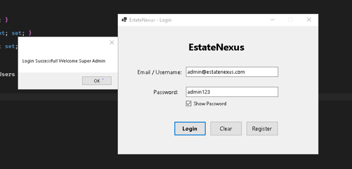
*Figure 6.1 — LoginForm featuring credential inputs, show/hide password toggle, clear form option, and successful authentication confirmation.*

## 6.2 Registration Form

The RegistrationForm collects the user's full name, email, phone, password, confirm password, and role selection. The role dropdown offers Customer and Admin. The form validates each field in sequence and provides specific error messages for each rule: empty fields, invalid email format, phone number format, password length, and password confirmation mismatch. The error messages appear on a label below the form and through the ErrorProvider on the individual fields.

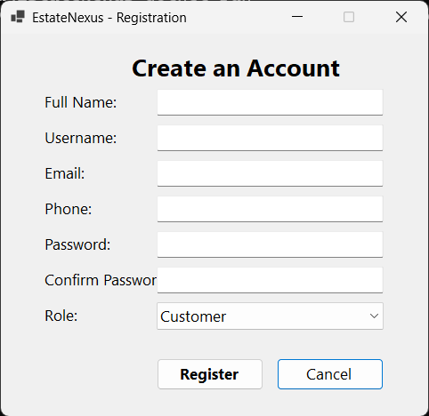
*Figure 6.2 — RegistrationForm featuring credential inputs, role selection (Customer/Admin), and field validation with inline ErrorProvider indicators.*

## 6.3 Customer Dashboard — Browse Properties Tab

The Browse Properties tab is the first screen the customer sees after logging in. The top section contains a keyword search text box and five filter dropdowns: Listing Type, Category, District, Price Range, and Bedrooms. An Apply Filters button and a Reset Filters button sit next to the search box. Below these controls is a data grid showing the matched listings. Each row displays the Property ID, Title, Category, Listing Type, Location, Address, Area Size, Area Unit, Bedrooms, Bathrooms, Price, Status, and Seller. A label below the grid shows a real-time count such as "5 properties found". At the bottom of the tab there are buttons for Add to Cart, Schedule Visit, and a rental months spinner.

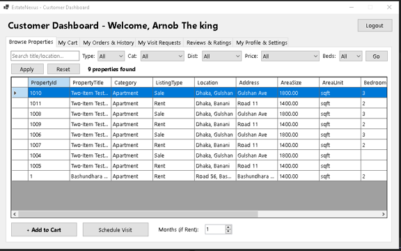
*Figure 6.3 — Customer Dashboard (Browse Properties) displaying multi-parameter filters (type, category, district, price, bedrooms), live results counter, catalog DataGridView, cart controls, and visit scheduling.*

## 6.4 Customer Dashboard — My Cart Tab

The My Cart tab displays a grid of items currently in the customer's cart. Each row shows the CartItemId, PropertyId, Property Title, Listing Type, Rental Months, Unit Price, Offered Price (total), and Location. A label at the bottom shows the running cart total. A payment method dropdown sits above a Checkout button and a Remove button. The payment dropdown includes Cash, Card, Bkash, Nagad, and Bank Transfer.

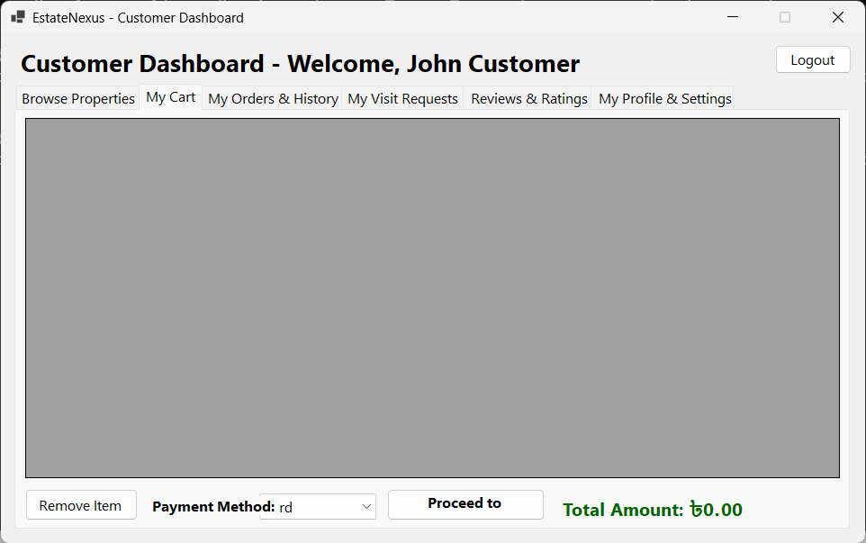
*Figure 6.4 — Customer Dashboard (My Cart tab) displaying selected properties, running subtotal calculation, payment method selector, and checkout trigger.*

## 6.5 Invoice Form

After a successful checkout, the InvoiceForm opens as a modal dialog. It displays the invoice number, generation date, customer name and email, payment method, transaction ID, and payment status. A line item table below lists each property with the listing type, rental months, unit price, and final amount. A summary section at the bottom shows the SubTotal, any discount, commission amount, and the total paid. A Print Invoice button at the bottom triggers the system print dialog.

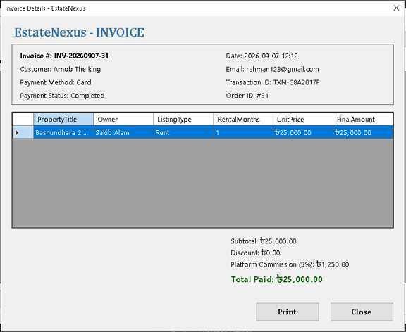
*Figure 6.5(a) — InvoiceForm modal displaying order breakdown, line items with BDT pricing, and the 5% platform commission calculation.*

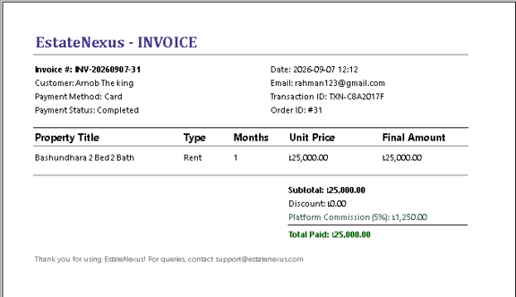
*Figure 6.5(b) — PrintDocument layout generated for physical printing and PDF export, formatted with company branding and summary totals.*

## 6.6 Customer Dashboard — My Visits Tab

The My Visits tab shows all visit requests submitted by the customer. Each row displays the visit ID, property title, visit date, visit time, request status, and any customer note. A Cancel Visit button at the bottom allows the customer to cancel requests that are still in Pending status.

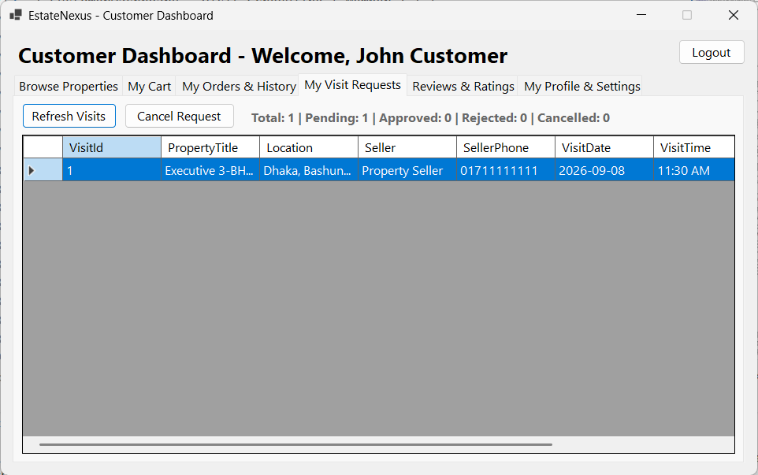
*Figure 6.6 — Customer Dashboard (My Visits tab) showing visit appointments, schedule details, and status indicators.*

## 6.7 Admin (Seller) Dashboard — My Properties Tab

The My Properties tab shows a grid of all listings owned by the logged-in seller. A summary label above the grid shows the count of total, available, and sold listings. An Add Property button opens the AddPropertyForm as a blank entry form. An Edit Property button opens the AddPropertyForm pre-filled with the selected listing's data.

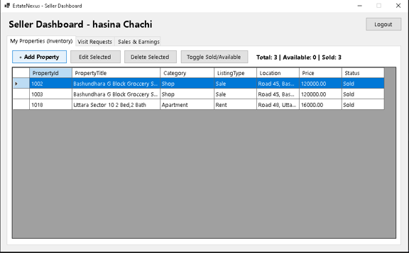
*Figure 6.7 — Seller Dashboard (My Properties inventory) showing property listing summary counters, Add/Edit/Delete actions, status toggle, and catalog DataGridView.*

## 6.8 Admin (Seller) Dashboard — Visit Requests Tab

The Visit Requests tab shows all incoming site visit requests from customers for the seller's properties. Pending requests appear at the top. The seller can select a request and click Approve or Reject. A filter dropdown allows the seller to view requests by status.

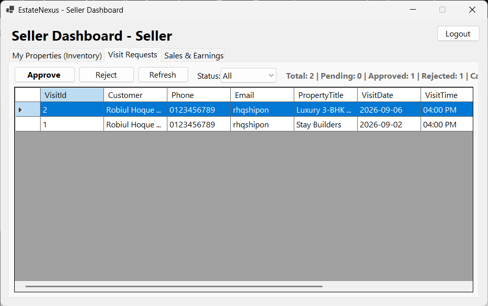
*Figure 6.8 — Seller Dashboard (Visit Requests tab) displaying customer inspection appointments, status filters, and approval/rejection controls.*

## 6.9 Add Property Form

The AddPropertyForm is used for both creating and editing listings. It contains dropdowns for Category and Listing Type, text inputs for Title, District, Area Location, Full Address, Area Size, Area Unit, Bedrooms, Bathrooms, Price, and a multi-line text area for Description. An image upload button allows the seller to browse their file system and attach an image, with a preview box showing the selected image before saving.

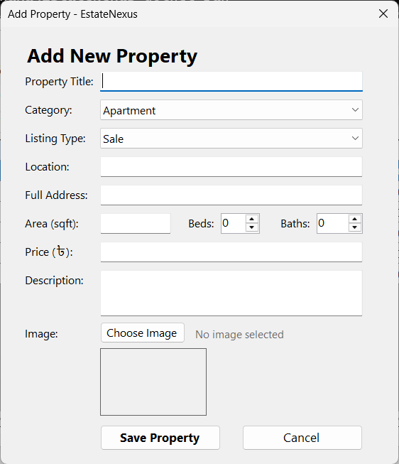
*Figure 6.9 — AddPropertyForm dialog with listing specifications, pricing inputs, category dropdowns, and image attachment preview.*

## 6.10 Super Admin Dashboard — Users Tab

The Users tab shows all registered accounts in a data grid. Two filter dropdowns at the top allow filtering by Role and Account Status. A pending approvals badge label near the top shows the count of accounts still in Pending status. Four action buttons: Approve, Reject, Suspend, and Activate. Approve and Reject only work on Pending accounts. Suspend and Activate work on Active and Suspended accounts respectively. All buttons are disabled when the Super Admin's own account is selected.

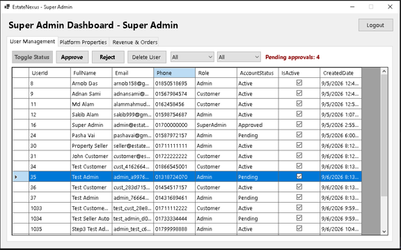
*Figure 6.10 — Super Admin Dashboard (Users tab) showing pending seller registration counter badge, role/status filters, Approve/Reject/Toggle actions, and user governance DataGridView.*

---

# Chapter 7 — Work Distribution Table

| Task Area | Assigned Member | Focus Category |
|-----------|-----------------|----------------|
| Database schema design and normalisation | Member 1 | Database Architecture |
| DatabaseSetup.cs — Automatic initialization and migration | Member 1 | Database Architecture |
| LoginForm and RegistrationForm with validation | Member 2 | Security & Authentication |
| SHA-256 password hashing (PasswordHelper.cs) | Member 1 | Security & Cryptography |
| Session management (Session.cs) | Member 2 | Session State |
| CustomerDashboard — Browse and Filter | Member 1 | Customer Experience |
| CustomerDashboard — Cart and Checkout | Member 1 | Customer Experience |
| InvoiceForm with PrintDocument support | Member 1 | Customer Experience |
| CustomerDashboard — Visit Scheduling | Member 1 | Customer Experience |
| CustomerDashboard — Reviews and Profile | Member 1 | Customer Experience |
| AdminDashboard — Property management | Member 2 | Seller / Admin Features |
| AdminDashboard — Visit request management | Member 2 | Seller / Admin Features |
| AddPropertyForm with image upload | Member 2 | Seller / Admin Features |
| SuperAdminDashboard — User management | Member 2 | Super Admin Features |
| SuperAdminDashboard — Revenue reporting | Member 2 | Super Admin Features |
| EF Core entity models (Models/Entities/) | Member 2 | Data Modeling |
| EstateNexusDbContext.cs model configuration | Member 1 | Data Layer |
| UI Theme (Theme.cs) | Member 2 | UI System |
| Testing and bug fixing | Both Members | Collaborative QA |
| Report writing | Both Members | Academic Documentation |

---

# Chapter 8 — Conclusion and Future Work

## 8.1 Conclusion

EstateNexus was built to solve a real problem that many property seekers in Dhaka face: the absence of a single trustworthy platform where they can browse verified listings, engage directly with sellers, and complete a transaction without going through unverified middlemen. The system delivers a working end-to-end solution covering the full cycle from registration to purchase and invoice generation.

The project was built using C# and Windows Forms on the .NET 10 runtime, with Entity Framework Core handling all database interactions and Microsoft SQL Server storing the data. The 19-table schema was designed to Third Normal Form to eliminate data redundancy and maintain integrity across all operations.

The three-role model, where Customers, Sellers, and a Super Admin each have distinct and clearly separated capabilities, reflects a realistic platform governance model. The Super Admin approval workflow for seller accounts ensures that only verified sellers can list properties. The atomic checkout transaction ensures that a purchase either completes fully or leaves no trace in the database, protecting both the customer and the platform from partial-state data errors.

The password security implementation upgrades any legacy plain-text passwords on first login and stores all new passwords as SHA-256 hashes, which ensures that the user database is secure even if the SQL Server instance is accessed directly.

Overall the project met all core functional requirements, successfully implemented the commission model, and produced a functional invoicing and printing workflow that gives customers a formal record of every transaction.

## 8.2 Future Work

Several features were designed and database tables were provisioned for them but they fall outside the current implementation scope. These are planned for future development phases.

**Complaint and Dispute System**

The Complaints table is already in the schema with full support for complaint types, priority levels, status tracking, and resolver assignment. The next phase would add a Complaint Submission form to the CustomerDashboard and a Complaint Review panel to the SuperAdminDashboard.

**Offers and Negotiation Engine**

The Offers table supports both percentage and flat-amount discount types with start and end dates. A future feature would allow sellers to attach time-limited offers to their listings, with the customer seeing the discounted price automatically applied when adding to cart.

**Featured Listing Promotions**

The FeaturedListings table supports paid promotions where sellers can pay to have their property appear at the top of browse results. The IsFeatured flag on the Properties table already controls sort order in the browse query, so the main work remaining is the payment workflow and the Admin UI to manage promotion slots.

**Advanced Feature Tagging and Filtering**

The PropertyFeatures and PropertyFeatureMappings tables are already seeded with six amenity types. The future enhancement would surface these features as filterable checkboxes on the Customer browse tab, allowing buyers to search specifically for listings with a Swimming Pool or Car Parking.

**Automated Password Reset**

Currently there is no self-service password recovery flow. A future addition would implement email-based verification tokens, allowing users to reset their password without contacting a system administrator.

**Mobile or Web Version**

The current application is a Windows desktop program. A future version could expose the same SQL Server database through a REST API and deliver the customer-facing experience as a mobile application or a web portal, significantly expanding the platform's reach.

